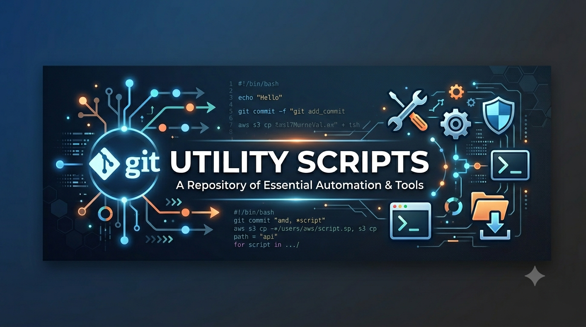

### Gary's Utility Scripts

A collection of utility scripts and shell libraries for macOS development, system maintenance, and workflow automation.

## Table of Contents

- [Scripts](#scripts)
- [Shell Library Functions](#shell-library-functions)
- [Tests](#tests)
- [Zsh Shell Completions](#zsh-shell-completions)
- [Xcode Project Templates](#xcode-project-templates)
- [Pictures](#pictures)

---

## Scripts

| Script | Language | Description |
|--------|----------|-------------|
| [blog-post.sh](#blog-postsh)                                 | Bash | Create Jekyll blog posts |
| [bootstrap.sh](#bootstrapsh) | Bash | Bootstrap a new Mac setup |
| [check-folder-icons.py](#check-folder-iconspy) | Python | Verify and repair macOS custom folder icons |
| [check-path.py](#check-pathpy) | Python | Validate PATH directories |
| [find-permission-based-API-usage.sh](#find-permission-based-api-usagesh) | Bash | Find iOS permission-requiring APIs |
| [finder-setup.sh](#finder-setupsh) | Bash | Configure Finder preferences and window layout |
| [fix-xcode-templates.py](#fix-xcode-templatespy) | Python | Fix Xcode file header templates |
| [format-project.sh](#format-projectsh) | Bash | Format source code in projects |
| [generate-gitkeep.sh](#generate-gitkeepsh) | Bash | Add .gitkeep files to empty directories |
| [git-applescript-filter.sh](#git-applescript-filtersh) | Bash | Git clean/smudge filter for AppleScript |
| [git-log.sh](#git-logsh) | Bash | Pretty git log with signature highlighting |
| [git-plist-filter.sh](#git-plist-filtersh) | Bash | Git clean/smudge filter for plist files |
| [git-rebase-mine-to.sh](#git-rebase-mine-tosh) | Bash | Git merge and rebase utility |
| [load-simulator.py](#load-simulatorpy) | Python | Restore iOS simulator state |
| [make-mac-icon.sh](#make-mac-iconsh) | Bash | Make a macOS icon given image file |
| [meeting-direct-link.py](#meeting-direct-linkpy) | Python | Convert meeting URLs to app links |
| [new-xcode-project.py](#new-xcode-projectpy) | Python | Generate Xcode projects from templates |
| [ocd.sh](#ocdsh) | Bash | System cleanup and maintenance |
| [refresh-compile-commands.sh](#refresh-compile-commandssh) | Bash | Regenerate LSP compile_commands.json |
| [reset-dates.py](#reset-datespy) | Python | Reset file dates and copyright headers |
| [safari-cleaner.py](#safari-cleanerpy) | Python | Delete Safari data for non-bookmarked sites |
| [safari-restore-icons.sh](#safari-restore-iconssh) | Bash | Restore custom Safari favicons |
| [safari-update-icons.sh](#safari-update-iconssh) | Bash | Upload Safari favicon cache to server |
| [settings.sh](#settingssh) | Bash | Configure macOS system settings |
| [startup-banner.py](#startup-bannerpy) | Python | Display terminal startup banner |
| [strip-app.sh](#strip-appsh) | Bash | Strip Intel slices and dead languages from app bundles |
| [strip-comments.py](#strip-commentspy) | Python | Remove comments from C-style source |
| [sync-mac.sh](#sync-macsh) | Bash | Sync files between Mac systems |
| [unix-le.sh](#unix-lesh) | Bash | Convert text files to Unix line endings |
| [update-dots.sh](#update-dotssh) | Bash | Maintain dotfiles repository |
| [update-site.sh](#update-sitesh) | Bash | Deploy Jekyll website |
| [update-software.sh](#update-softwaresh) | Bash | Update macOS, App Store, Homebrew and Sparkle apps |
| [wtf-autolayout.py](#wtf-autolayoutpy) | Python | Debug Auto Layout constraints |

---

## Script Details

---


### blog-post.sh

Creates a new Jekyll blog post or product page with the appropriate front matter and timestamp. Generates files in the `~/Sites/geedbla.com/` directory structure.

**Usage:** `blog-post.sh <blog|products> "Title"`

---

### bootstrap.sh

Bootstraps a fresh macOS installation by setting up dotfiles, installing Homebrew packages, configuring shells (bash/zsh), installing Ruby gems and Python packages, and setting up the ZDOTDIR environment.

---

### check-folder-icons.py

Checks that a folder's custom icon is set up the way the Finder expects: an invisible `Icon\r` file whose resource fork holds an `icns` resource with id -16455, inside a folder whose Finder flags carry the custom icon bit. Also reports an icon file with a stray data fork, a folder flagged as having a custom icon it no longer contains, and a plain `Icon` file misnamed without its trailing carriage return. With `--fix` it repairs the Finder flags and the icon file's permissions; a missing or damaged resource fork is reported but left alone.

**Usage:** `check-folder-icons.py [-r] [-f] [-q] <folder> [folder ...]`

**Options:**
- `-r, --recursive` — Check every folder beneath the ones named
- `-f, --fix` — Repair the problems that can be repaired
- `-q, --quiet` — Report nothing; use the exit status
- `-h, --help` — Show the usage message

**Note:** Exits 0 when nothing is wrong, 1 when an unrepaired error remains and 2 on a malformed command line. A recursive run costs one `xattr` call per folder, so aim it at specific trees rather than an entire home directory.

---

### check-path.py

Scans the current PATH environment variable and reports which directories exist and which are missing. Outputs a clean PATH declaration containing only valid directories.

**Usage:** `check-path.py`

---

### find-permission-based-API-usage.sh

Scans Swift and Objective-C source files for usage of APIs that require runtime permissions or entitlements (e.g., file dates, system uptime, disk capacity, UserDefaults).

**Usage:** `find-permission-based-API-usage.sh <directory>`

---

### finder-setup.sh

Configures Finder preferences including list view with specific columns (name, size, kind, date created, date modified), show all files and extensions, sort folders first, and suppresses .DS_Store on network and USB volumes. Cleans existing .DS_Store files, restarts Finder, and uses AppleScript to set the Downloads folder view, resize windows, and clear recent items.

**Usage:** `finder-setup.sh`

**Note:** Requires Accessibility permissions for System Events automation.

---

### fix-xcode-templates.py

Modifies Xcode's internal file and project templates to remove the `//` comment prefix from `___FILEHEADER___` placeholders, allowing custom file headers to work correctly.

**Note:** Requires sudo privileges.

---

### format-project.sh

Runs multiple code formatters on a project directory including uncrustify (C/Objective-C), swiftformat (Swift), black (Python), shfmt (Bash), and perltidy (Perl).

**Usage:** `format-project.sh [directory]`

---

### generate-gitkeep.sh

Traverses a directory tree and adds a `.gitkeep` file to any directory that does not contain files. Useful for preserving empty directory structures in Git repositories.

**Usage:** `generate-gitkeep.sh [directory]`

---

### git-applescript-filter.sh

A Git clean/smudge filter for compiled AppleScript (`.scpt`) files. In `--clean` mode it decompiles a compiled script to source text for storage in Git; in `--smudge` mode it recompiles source text back to a compiled script on checkout.

**Usage:** Configured via `.gitattributes`:
```
*.scpt filter=applescript diff=applescript
```

---

### git-log.sh

Displays a decorated, graphed git log with commit signature verification. Good signatures are highlighted in green and bad signatures in red using 24-bit truecolor ANSI escapes via Python.

**Usage:** `git-log.sh [git-log-options...]`

**Requirements:** Git with SSH or GPG signing enabled, truecolor-capable terminal.

---

### git-plist-filter.sh

A Git clean/smudge filter for binary plist files. In `--clean` mode it converts a binary plist to XML for readable diffs in Git; in `--smudge` mode it converts XML back to binary plist on checkout.

**Usage:** Configured via `.gitattributes`:
```
*.plist filter=plist diff=plist
```

---

### git-rebase-mine-to.sh

Merges the current branch into a target branch (with --no-ff) and then rebases the current branch onto the target branch.

**Usage:** `git-rebase-mine-to.sh <branch>`

---

### load-simulator.py

Resets all iOS simulators and restores a consistent state by loading media files from a backup folder into each simulator.

---

### make-mac-icon.sh

Make a macOS icon file gen a graphical image file
Note thate Image Magick is required

**Usage:** `make-mac-icon.sh <graphic fie>`

---

### meeting-direct-link.py

Converts Microsoft Teams and Zoom web URLs into direct app launch URLs (msteams:// and zoommtg:// protocols).

**Usage:** `meeting-direct-link.py <url>`

---

### new-xcode-project.py

Generates a new Xcode project from customizable templates. Supports options for GitHub repository creation, open/closed source licensing, and in-file license headers.

**Usage:** `new-xcode-project.py <template> <name> <location> [company] [bundle-id]`

**Options:**
- `-ng, --no-github` - Don't create GitHub repository
- `-nx, --no-xcode` - Don't open Xcode after generation
- `-cs, --closed` - Use closed source license
- `-lif, --inFileLicense` - Add license text to source files

**Templates:** Project templates are located in `templates/Xcode/`. See [Xcode Project Templates](#xcode-project-templates).

---

### ocd.sh

Comprehensive macOS system maintenance script that updates Homebrew, gems, pip, and npm packages; cleans caches, history, and temporary files; resets application preferences; clears browser data; and performs various system optimizations.

**Usage:** `ocd.sh [restart|off]`

---

### refresh-compile-commands.sh

Regenerates `compile_commands.json` files for all Xcode projects in ~/Developer to enable LSP support in editors.

---

### reset-dates.py

Resets file creation/modification dates and updates copyright headers in source files. Handles various file types including Xcode project files and compiled AppleScript.

**Usage:** `reset-dates.py "Company Name" [file|directory ...]`

---

### safari-cleaner.py

Deletes Safari website data (cookies, local storage, observations, URL cache, WebKit cache, Screen Time web usage, and HTTP Alternative Services) for domains that do not match any bookmarked website. Parses and rewrites Safari's `Cookies.binarycookies` file directly.

**Usage:** `safari-cleaner.py [--dry-run|-n] [--verbose|-v]`

**Options:**
- `-n, --dry-run` — Report what would be removed without making changes
- `-v, --verbose` — Print each deleted entry

**Note:** Safari must be quit before running.

---

### safari-restore-icons.sh

Downloads and installs custom Safari favicon files from a remote server to replace the default Apple icons.

---

### safari-update-icons.sh

Archives Safari favicon cache directories and uploads the archive to a remote server via scp. Retrieves the server password from the macOS Keychain.

**Usage:** `safari-update-icons.sh`

---

### settings.sh

Configures various macOS system defaults including Finder settings, keyboard behavior, Safari options, and Xcode preferences. Also enables developer tools security.

---

### startup-banner.py

Displays a colorful terminal startup banner with system information including OS version, hardware specs, Homebrew status, IP addresses, disk usage, and battery status. Supports both light and dark themes.

**Usage:** `startup-banner.py [--light|--dark]`

---

### strip-app.sh

Reclaims disk space in macOS application bundles by removing the Intel (`x86_64`/`i386`) slices from universal Mach-O files and deleting localizations that do not match the current system language. With no bundle named, every app in `/Applications` is processed.

**Nothing is ever re-signed.** Only changes that provably cannot break the seal are made, so bundles keep their original Developer ID, notarization ticket, and the privacy permissions macOS records in `com.apple.macl`. Two facts make that possible:

- Every slice of a universal Mach-O carries its own complete signature, so dropping the Intel slice leaves the arm64 slice — and its CDHash — byte for byte identical. A binary can therefore be thinned whenever its bundle seals it by CDHash (nested code) or not at all (the bundle's own executable). A Mach-O sealed as plain *content*, in practice anything under `Resources/`, is left fat: thinning it is exactly the mistake that leaves a bundle failing `codesign --verify`.
- `codesign`'s default resource rules mark `^Resources/.*\.lproj/` as *optional*, so a missing localization does not invalidate the seal. `Base.lproj` carries no optional flag and is always kept, as is the last localization of any bundle that has no `Base` or English fallback.

Every change is staged before it is made and `codesign` gets the last word on each bundle; anything it objects to is put back, and a bundle that still will not verify is rolled back completely. Bundles are skipped when they are Apple-signed, SIP-protected, or already failing verification before the run starts.

A running app cannot be rewritten, so you are asked whether to quit it — but only once the bundle is known to have Intel slices left to remove, so an app that is already arm only is passed over without a prompt. Under `--no-thin` there is nothing that can be checked ahead of time and the question is put as before. The request is a normal quit Apple event, so the app closes its documents exactly as it would from its own menu, and one that does not go within twenty seconds is left alone rather than killed. The app hosting the terminal the run is living in is never offered: quitting it would take the script down with it, halfway through a bundle it has already begun to rewrite. Apps quit for a strip are not relaunched afterwards.

**Usage:** `strip-app.sh [options] [<app-bundle> ...]`

**Options:**
- `-n, --dry-run` — Report only, change nothing
- `--quit` — Quit a running app without asking, so it can be processed
- `--no-quit` — Leave running apps alone without asking
- `--keep LANGS` — Comma separated extra languages to preserve (e.g. `de,ja`)
- `--no-lang` — Skip localization pruning
- `--no-thin` — Skip Intel slice removal
- `--check` — Report bundles whose seal is already broken, and why
- `--repair` — Report how to repair the bundles `--check` found
- `-v, --verbose` — List every file acted on

**Note:** An app update replaces the bundle, so the script must be re-run afterwards. Escalates to sudo automatically when a target bundle is root owned.

---

### strip-comments.py

Removes all C-style comments (both `//` and `/* */`) from source files in a directory tree. Handles nested comments and preserves strings.

**Usage:** `strip-comments.py [directory]`

---

### sync-mac.sh

Synchronizes directories, files, and package manager installations between multiple Mac systems over SSH. Syncs:

- **Directories** — `~/.claude`, `~/.config`, `~/Developer`, `~/Documents`, `/opt/bin`, `/opt/geedbla`, BBEdit support files
- **Files** — `~/.claude.json`
- **Mail** — Mail archive (`~/Library/Mail`) and Mail preferences
- **Package managers** — Homebrew formulae and casks, pip packages, Ruby gems, npm packages (installs missing, removes extras)
- **Custom apps** — Bespoke applications (CleanStart.app, XcodeGeeDblA.app) installed to `/Applications` via sudo. Sudo password prompts are suppressed and sync failures produce descriptive error messages without aborting the remaining sync operations.

---

### unix-le.sh

Walks a directory tree and converts every file that `file` identifies as text from Windows (CRLF) or classic Mac (CR) line endings to Unix line feeds, editing each file in place and naming it as it goes.

**Usage:** `unix-le.sh [directory]`

---

### update-dots.sh

Maintains a dotfiles Git repository by collecting configuration files, preferences, and application settings from the system and pushing updates to GitHub.

**Usage:** `update-dots.sh [--package]`

---

### update-site.sh

Builds a Jekyll website and deploys it to a remote server via rsync.

---

### update-software.sh

Checks macOS system and App Store updates, Homebrew packages, and Sparkle enabled applications in `/Applications` and `~/Applications`, reporting what is out of date and prompting before each group is installed. Sparkle updates are found by reading each bundle's `SUFeedURL` appcast and comparing the advertised version against `CFBundleShortVersionString`, then downloading and replacing the installed bundle.

**Usage:** `update-software.sh`

---

### wtf-autolayout.py

Parses Auto Layout constraint warnings from Xcode and opens wtfautolayout.com with the constraint log for analysis and debugging help.

**Usage:** `wtf-autolayout.py <constraint-log>`

---

## Shell Library Functions

Reusable shell functions located in `lib/shell/lib/` that can be sourced into scripts.

### get_sudo_password.sh

Provides secure sudo password retrieval for scripts that require elevated privileges.

**Function:** `get_sudo_password`

**Description:** Retrieves the user's sudo password through a secure multi-step process:
1. First checks if sudo is already authenticated (non-interactive validation)
2. Attempts to retrieve the password from the macOS Keychain (`security find-generic-password`)
3. Falls back to interactive password prompt if keychain lookup fails

**Returns:** The sudo password on stdout (for use with `sudo --stdin`)

**Usage:**
```bash
source "/opt/geedbla/lib/shell/lib/get_sudo_password.sh"

SUDO_PASSWORD="$(get_sudo_password)"
echo "$SUDO_PASSWORD" | sudo --validate --stdin
```

---

### get_notary_password.sh

Provides secure retrieval of Apple notarization service credentials.

**Function:** `get_notary_password`

**Description:** Retrieves the Apple notarization service password for code signing workflows:
1. Attempts to retrieve the password from the macOS Keychain (`security find-generic-password`)
2. Falls back to interactive password prompt if keychain lookup fails

**Returns:** The notarization password on stdout

**Usage:**
```bash
source "/opt/geedbla/lib/shell/lib/get_notary_password.sh"

NOTARY_PASSWORD="$(get_notary_password)"
xcrun notarytool submit app.zip --apple-id "$APPLE_ID" --password "$NOTARY_PASSWORD"
```

---

### log.sh

Provides the diagnostic output routines shared by the scripts in this repository.

**Functions:** `log_line`, `log_info`, `log_verbose`, `log_warn`, `log_error`, `log_die`, `log_color`

**Description:** Gives a script a severity ladder whose shape is decided by the caller
rather than by the library. Warnings, errors and fatals always go to standard error;
everything else goes to the descriptor named by `LOG_STREAM`. `log_error` keeps a running
count in `LOG_FAILURES`, and `log_die` reports and exits one. `log_color` emits a line
whose colour carries the meaning, for progress and for good and bad news, and applies that
colour only when the destination is a terminal, so a redirected or piped run gets clean
text instead of embedded escape sequences.

The caller shapes output through these variables: `LOG_PREFIX` stamps a name on every
line, `LOG_STREAM` selects the descriptor for non-severity output, `LOG_VERBOSE` gates
`log_verbose`, `LOG_HOOK` names a function run before each severity line, and `LOG_INDENT`
and `LOG_INDENT_VERBOSE` indent `log_info` and `log_verbose`. The colour constants
`LOG_GREEN`, `LOG_YELLOW`, `LOG_RED` and `LOG_RESET` are provided for `log_color`.

The file is sourced, so it deliberately sets no shell options; doing so would change the
behaviour of whatever script pulled it in. Every assignment is conditional, so sourcing it
more than once is harmless.

**Usage:**
```bash
source "/opt/geedbla/lib/shell/lib/log.sh"

LOG_PREFIX="${0##*/}"
LOG_STREAM=2

log_info "starting"
log_warn "target unreachable"
log_die "required command not found"
```

---

## Tests

A `unittest` suite covering the Python scripts, located in `scripts/tests/`. The scripts
carry hyphenated names, so `scripts.py` loads them as importable modules by path; the
tests exercise the parsing and rewriting logic directly rather than driving the command
lines.

| File | Covers |
|------|--------|
| `scripts.py` | Helper that imports a hyphenated script as a module |
| `test_check_folder_icons.py` | The resource fork parser behind the custom folder icon checker |
| `test_load_simulator.py` | The simulator loader's device and media discovery |
| `test_new_xcode_project.py` | The project generator's text wrapping and header rewriting |
| `test_reset_dates.py` | The header rewriting done by the date resetter |
| `test_safari_cleaner.py` | The Safari cleaner's domain matching and binary cookie handling |
| `test_startup_banner.py` | The banner's parsing of `system_profiler` output |
| `test_strip_comments.py` | The comment stripper's scanner |

**Usage:**
```bash
cd scripts/tests
python3 -m unittest discover -p 'test_*.py'
```

---

## Zsh Shell Completions

Tab completion definitions located in `zsh-completions/` that can be added to a `$fpath` directory for zsh.

| File | Command | Description |
|------|---------|-------------|
| `_jekyll` | `jekyll` | Tab completion for Jekyll subcommands and options |
| `_new-xcode-project` | `new-xcode-project.py` | Tab completion for project templates (dynamically read from `templates/Xcode/`) and all command-line flags |
| `_ocd` | `ocd.sh` | Tab completion for `ocd.sh` providing the `restart` and `off` subcommands |
| `_tv` | `tv` | Tab completion for the television (tv) TUI fuzzy finder |

---

## Xcode Project Templates

Reusable Xcode project templates located in `templates/Xcode/`, used by `new-xcode-project.py` to generate new projects.

### Project Templates

| Template | Description |
|----------|-------------|
| `2DGame` | Multiplatform SpriteKit-based game (iOS, macOS, tvOS) |
| `AppKitProject` | AppKit-based macOS application with unit and UI tests |
| `CppCLITool` | C++ command-line tool with Objective-C++ unit tests |
| `MultiPlatform` | SwiftUI multiplatform app (iOS + macOS) with unit and UI tests |
| `SwiftCLITool` | Swift command-line tool with a separate core library and unit tests |
| `UIKitProject` | UIKit-based iOS application with unit and UI tests |

Each template directory contains a complete `.xcodeproj` and source tree that `new-xcode-project.py` copies and customizes with the project name, company, bundle identifier, and license.

### Shared Files (`_Files/`)

Files in `templates/Xcode/_Files/` are applied to every generated project regardless of template:

| File / Directory | Description |
|------------------|-------------|
| `Assets.xcassets.zip` | Pre-built asset catalog (app icon slots, accent color, etc.) |
| `BuildEnv/` | Build phase scripts: `ci.sh`, `increment-build-number.sh`, `stamp-beta-version.sh`, `restore-stamped-icon.sh`, `swiftlint-project.sh`, `export-github-secrets.sh` |
| `IDETemplateMacros.plist` | Xcode file header template macros |
| `IDETemplateMacros-Open.plist` | Header macros variant for open-source projects |
| `IDETemplateMacros-Closed.plist` | Header macros variant for closed-source projects |
| `LICENSE-Open.md` | Open-source license text |
| `LICENSE-Closed.md` | Closed-source license text |
| `ci.sh` | Local CI runner script |
| `organizations.txt` | Known organization names for copyright substitution |

---

## Pictures

Resource images located in `pictures/` used by scripts.

| File | Description |
|------|-------------|
| `apple-logo.png` | Apple logo image |
| `SimpleGrey.heic` | Desktop wallpaper image |

---

## Author

Gary Ash <gary.ash@icloud.com>

## License

Copyright 2026 By Gary Ash. All rights reserved.
